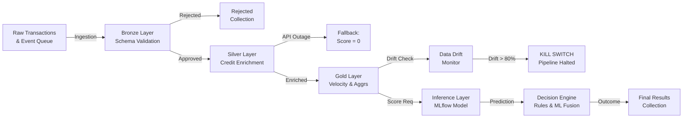
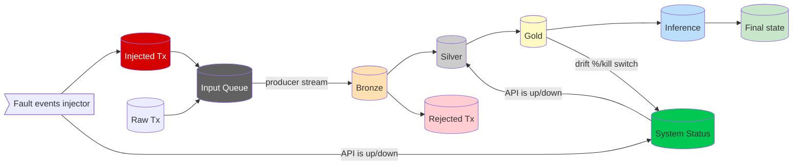

# 🔬 ML Resilience Lab: Resilient Real-Time Data Ingestion & Fraud Detection Pipeline

Welcome to the **ML Resilience Lab**! This project is an advanced experimental playground designed to showcase resilience patterns, fault tolerance, and chaos engineering principles within production-grade machine learning pipelines. Combining a real-time Medallion streaming architecture with targeted fault injection, the lab simulates a live credit card processing environment where predictive models are shielded against corrupted inputs, downstream dependency outages, and statistical data drift.

---

## 📌 Project Overview

In real-world production systems, a machine learning model is only as robust as the data pipeline that feeds it. Schema anomalies, API timeouts from enrichment services, and shifting user behaviors (data drift) often cause silent, catastrophic failures or severe degradation in model accuracy.

**ML Resilience Lab** addresses this vulnerability by implementing a **multi-layered defense system** for real-time credit card fraud detection (based on the Kaggle *Credit Card Fraud Detection* dataset). The project pairs a highly optimized **Python-based** streaming backend with a state-of-the-art **Next.js** and **TypeScript** dashboard, allowing developers and data scientists to interactively inject faults and inspect system reactions in real time.

---

## 🏗️ System Architecture & Medallion Data Flow

Transactions flow through a progressive **5-stage Medallion Architecture** in streaming mode. This structure ensures that every transaction is strictly validated, enriched, monitored, scored, and audited:



### 1. Bronze Layer (Ingestion & Schema Enforcement)

* **Role:** Strict structural validation of incoming raw transaction events.
* **Technology:** Data contracts enforced via **Pydantic v2** (`BronzeContract`).
* **Resilience:** If an incoming transaction contains corrupted data (e.g., negative transaction amounts, missing timestamps, or non-numeric feature vectors), it is caught instantly by Pydantic validation and redirected to a `transactions_rejected` collection, logging the exact error message. This prevents downstream contamination of both inference databases and future training runs.

### 2. Silver Layer (Data Enrichment & Circuit Breakers)

* **Role:** External enrichment of incoming transactions.
* **Resilience (Circuit Breaker):** Simulates an integration with a third-party credit score service (`_mock_credit_score_api`). If this API fails or encounters extreme latency, a proactive **Circuit Breaker** transitions to the **OPEN** state. Instead of stalling the streaming pipeline, the system applies an emergency **fallback value** (Credit Score = `0`) and flags the transaction, allowing it to progress to the decision engine for prioritised human oversight.

### 3. Gold Layer (Velocity Aggregations & Drift Safeguards)

* **Role:** Compute sliding window aggregations and check for systemic distribution anomalies.
* **Velocity Checks:** Tracks short-term user transactional frequency (`tx_count_last_1s`) to detect card testing.
* **Resilience (Data Drift & Kill Switch):** Continuously monitors transaction timestamp distributions. If a significant spike in transaction volume occurs during off-hours (like 04:00 AM bursts), it indicates a statistical **Data Drift**. Since machine learning models lose predictive stability when live features deviate from the training distribution, a threshold of **80% drift** triggers an automated **Kill Switch** that halts pipeline execution to prevent erroneous automated decisions.

### 4. Inference Layer (MLflow Model Scoring)

* **Role:** High-speed, real-time machine learning prediction scoring.
* **Technology:** Asynchronously invokes a trained ensemble model served via a REST API endpoint hosted by **MLflow**.
* **Payload Structuring:** Automatically maps the raw customer variables and the 28 PCA-transformed features (V1-V28) to the precise format expected by the model.

### 5. Decision Engine (Human-in-the-Loop & Rule Fusion)

* **Role:** Merges deterministic business logic rules with probabilistic machine learning predictions.
* **Transaction Outcomes:**
  * `APPROVED`: If the model’s fraud probability is below **30%** and behavior complies with velocity rules.
  * `DENIED`: If the model indicates fraud with high confidence (>80%), or if a critical velocity rule is breached (suspected account takeover).
  * `TO_REVISE` (Human-in-the-Loop): If the transaction falls in the model's confidence "gray area" (30% to 80%), or if a fallback condition occurred (e.g., Credit Score is 0 due to API failure).

---

## 🔄 Reactive Pipeline Orchestration & State Deep-Dive

Beyond traditional batch architectures, this pipeline operates as a **state-driven reactive stream**. Rather than relying on simple chronological iterations, the orchestration loop, data layers, and chaos injections interact dynamically through a central state engine backed by **MongoDB**.



#### 1. Dual-Source Circular Producer Design

The data feeding mechanism is managed by the `Producer` class in `src/pipeline/layers/producer.py`. It implements a **prioritized hybrid streaming** pattern:

* **The Normal Path**: It streams raw credit card transaction records from the `transactions_raw` MongoDB collection sequentially using `_id` cursor-based pagination. To simulate an infinite real-time feed, once the cursor reaches the end of the collection, the producer automatically wraps around to the beginning.
* **The High-Priority Injected Path**: At the beginning of every iteration, before fetching from the normal path, the producer checks the `injected_events_queue` collection (populated via Next.js Server Actions or CLI commands in `src/pipeline/fault_injector.py`).
* If an injected event is present, the producer **instantly pops and hijacks the stream**, tagging the record with `_from_event_queue = True` and yielding it immediately. This allows chaos events (like invalid fields or specific fraud patterns) to be inserted in real time without restarting the stream.

#### 2. Reactive State Monitoring

Coordinating high-frequency microservices requires a decoupling of data and control planes. The orchestrator loop (`run.py`) and processing layers read and write globally synchronized states inside the `pipeline_status` collection.

* **Circuit Breaker Status (`api_is_up`)**: Modifiable directly from the dashboard. When set to `False` (simulating external credit scoring outage), the orchestrator passes this down to the `SilverLayer`. The layer reactively intercepts this state, bypasses the remote API invocation, applies an immediate fallback value of `0` to `credit_score`, and flags the record. This prevents network request timeouts and maintains maximum pipeline throughput.
* **Drift Control & System Interdiction (`drift_level` & `kill_switch`)**: The `GoldLayer` inspects timestamp frequencies. When a statistical anomaly occurs (e.g., an off-hour transaction volume spike in the 04:00 AM window), the layer writes to the database, scaling up the `drift_level` exponentially.
* Once `drift_level` crosses `DRIFT_THRESHOLD` (80%), the layer writes `kill_switch = True` into the status document.
* This immediately breaks the streaming ingestion, protecting downstream decision engines from processing potentially compromised data.

#### 3. Multi-Threaded Execution & Thread Throttling

To achieve concurrent real-time processing under load, the pipeline leverages Python's `concurrent.futures.ThreadPoolExecutor` (configured via the `--workers` CLI parameter):

* **Task Delegation**: Each yielded transaction is wrapped in a dedicated processing job (`_process_single_transaction`) and submitted to the thread pool, returning a `Future` object.
* **Active Worker Throttling**: To prevent unbounded thread spawns and CPU memory exhaustion under stress test modes, the orchestrator tracks active futures. If active workers reach the `max_workers` cap, the orchestrator blocks using:

  ```python
  done, active_futures = concurrent.futures.wait(
      active_futures, return_when=concurrent.futures.FIRST_COMPLETED
  )
  ```

  Once a thread completes, the orchestrator releases the slot and ingests the next record.
* **UI Pacing Coordination**: For human-in-the-loop demonstration visibility, each individual layer transition includes a small delay (`visual_delay = 1.5s`). This slows down concurrent processing just enough for live websockets to broadcast layer updates to the dashboard, allowing developers to visually audit transactions traversing from Bronze to Silver, Gold, and final decision states.

---

## ⚡ Chaos Engineering: Fault Injection Scenarios

Audit pipeline behavior interactively from the Next.js control panel using 5 specialized failure scenarios:

| Injected Anomaly         | Targeted Layer                 | Triggered Defense Pattern                                               | Observed UI Result                                                                                                    |
| :----------------------- | :----------------------------- | :---------------------------------------------------------------------- | :-------------------------------------------------------------------------------------------------------------------- |
| **Invalid Tx**     | **Bronze**               | Pydantic schema validation failure. Immediate diversion.                | Transaction appears in the Rejected collection with detailed validation error logs in the Alerts Table.               |
| **Kill API**       | **Silver**               | Circuit Breaker opens. Fallback credit score = 0 is applied.            | API Status indicators switch to **DOWN** (red). Transactions flow uninterrupted but flag as `TO_REVISE`.     |
| **Velocity Burst** | **Gold**                 | Card testing rule tripped (`tx_count > 10` in a 1-second window).     | Transactions are immediately marked as `DENIED` with "High transaction velocity detected" reason.                   |
| **Nightly Burst**  | **Gold / Inference**     | Statistical off-hour frequency monitor detects deviation.               | Live Data Drift gauge increases on dashboard. Exceeding**80%** triggers the Kill Switch, stopping the pipeline. |
| **Fraud Sample**   | **Inference / Decision** | ML model identifies non-linear fraud signatures within V1-V28 features. | Transaction is classified as `DENIED` showing high probability spikes in the distribution charts.                   |

---

## 📊 MLOps & Model Training with MLflow

The python backend includes a complete machine learning training and evaluation pipeline (`src/model/train.py`).

* **Supported Ensembles:** Random Forest (`rf`) and XGBoost (`xgb`).
* **Key Metric (AUPRC):** Since credit card fraud datasets are highly imbalanced (only 0.17% fraud cases), standard Accuracy is a misleading metric. The training pipeline optimizes for the **Area Under the Precision-Recall Curve (AUPRC)** while maximizing **Recall** to minimize expensive false negatives.
* **Reproducibility:** MLflow logs all hyperparameters, evaluation metrics (Precision, Recall, F1, AUC), plots (Confusion Matrices, Precision-Recall curves), and registers the champion model under the name `fraud-detector` in the MLflow Model Registry.

### Training Performance Comparison:

| Run Configuration          | Model Type                   |     ROC-AUC     | Recall (Fraud) | PR-AUC (AUPRC) | False Negatives | Registry Status                   |
| :------------------------- | :--------------------------- | :--------------: | :-------------: | :-------------: | :-------------: | :-------------------------------- |
| **baseline**         | **Random Forest (rf)** | **0.9917** | **88.9%** | **0.931** |   **5**   | **Active Version (Winner)** |
| **baseline**         | XGBoost (xgb)                |      0.9810      |      86.7%      |      0.931      |        6        | Evaluated                         |
| **scale_pos_weight** | XGBoost (xgb)                |      0.9753      |      84.4%      |      0.827      |        7        | Evaluated                         |

*Note: The Random Forest ensemble outperforms XGBoost on this particular dataset due to the clean, PCA-transformed nature of features V1-V28, where RF achieves optimal decision boundaries without requiring extensive hyperparameter adjustments.*

---

## 🛠️ Technology Stack

* **Backend (Python):** Python 3.11+, [uv](https://github.com/astral-sh/uv) (package resolver), Pydantic v2 (data contracts), Pandas, Scikit-learn, XGBoost, PyMongo.
* **MLOps & Inference:** MLflow (Experiment tracking, model registry, REST scoring server).
* **Databases:** MongoDB Atlas (multi-layer Medallion collections and injection event queues), SQLite (local MLflow store).
* **Frontend (Next.js):** TypeScript, Next.js 14/15 (App Router & Server Actions), Tailwind CSS, Vanilla CSS, Recharts, Lucide Icons.
* **Containers:** Docker and Docker Compose (orchestrating Next.js on `3005` and MLflow Model server on `5001`).
---

## 🏆 Conclusions & Core Robustness Guarantees

This playground highlights that **the safety of an intelligent system is not solely a function of model math accuracy**, but rather the strength of its surrounding operational architecture. 

By engineering a multi-layered defense system, the ML Resilience Lab enforces the following uncompromisable guarantees:

| Layer / Mechanism | Safeguard / Resilience Pattern | Concrete System Guarantee |
| :--- | :--- | :--- |
| **Bronze Layer** | Pydantic Schema Contracts | **100% Schema Hygiene**: Blocks dirty payloads early. Erroneous or malicious payloads are instantly isolated, guaranteeing that downstream models and databases are never polluted by bad data formats. |
| **Silver Layer** | State-driven Circuit Breakers | **Zero Timeout Outage**: Preserves high business availability. Remote scoring API degradation triggers instantaneous fallback behavior, maintaining line-rate pipeline throughput. |
| **Gold Layer** | Dynamic Time-Bucket Drift Safeguard | **Silent Inference Protection**: Protects model boundaries. Real-time statistical drift triggers an autonomous **Kill Switch**, halting automated actions when predictions are no longer statistically reliable. |
| **Decision Engine** | Probabilistic-Deterministic Fusion | **Sovereign Risk Mitigation**: Bridges automated confidence and governance. Fuses AI probabilities with strict business rule constraints to safely catch edge cases and ensure regulatory compliance. |

This multi-layered defense creates an **unbreakable data processing environment**. In a landscape where most ML platforms fail silently due to data changes, API outages, or unexpected inputs, the **ML Resilience Lab** seamlessly blends the rigorous standards of modern data engineering pipelines with machine learning best practices to build a truly resilient, self-healing, and highly observable AI architecture.
